https://www.coursera.org/learn/generative-ai-with-llms

# Introduction to LLMs and the generative AI project lifecycle

## Contributors

**Ehsan Kamalinejad, Ph.D.** is a Machine Learning Applied Scientist working on NLP developments at Amazon. Previously he co-founded Visual One, a YCombinator startup in computer vision. Before that, he was a Tech-Lead Machine Learning Engineer at Apple, working on projects such as Memories. EK is also an Associate Professor of Mathematics at California State University East Bay.

**Nashlie Sephus, Ph.D.** is a Principal Technology Evangelist for Amazon AI at AWS. In this role, she focuses on fairness and accuracy as well as identifying and mitigating potential biases in artificial intelligence. She formerly led the Amazon Visual Search team as an Applied Scientist in Atlanta which launched the visual search for replacement parts on the Amazon Shopping app.

**Heiko Hotz** is a Senior Solutions Architect for AI & Machine Learning with a special focus on natural language processing (NLP), large language models (LLMs), and generative AI. Prior to this role, he was the Head of Data Science for Amazon’s EU Customer Service. Heiko helps companies be successful in their AI/ML journey on AWS and has worked with organizations in many industries, including insurance, financial services, media and entertainment, healthcare, utilities, and manufacturing. In his spare time, Heiko travels as much as possible.

**Philipp Schmid** is a Technical Lead at Hugging Face with the mission to democratize good machine learning through open source and open science. Philipp is passionate about productionizing cutting-edge and generative AI machine learning models.

## Introduction

Primeira pergunta: eu devo pegar um modelo e fazer um zero shot ou preciso treinar? Qual modelo eu posso usar?

## Use cases & model lifecycle

Principais modelos de geração de linguagem com seus tamanhos comparativos:

Entrada de um modelo: prompt

Modelo tenta prever a continuação do prompt. Caso a entrada seja uma pergunta, a saída será uma resposta

Casos de uso
- Q&A
- Sumarização
- Tradução
- Geração de código
- Extração de entidades
- _Augmented LLMs_: conexão com outras bases e APIs para prover dados não fornecidos no pré treino. Exemplo: perguntar a um modelo se um voo está atrasado ou não

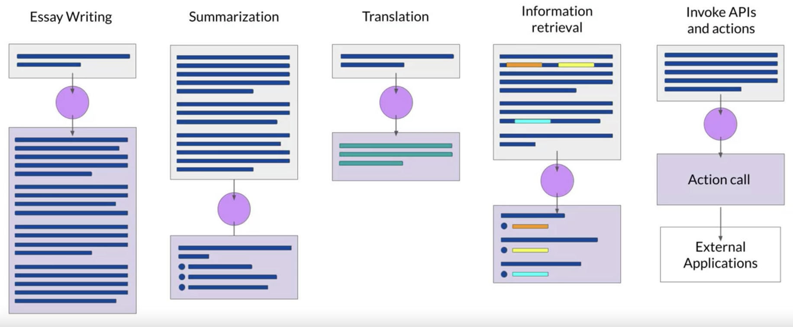

### Text generation before transformers

Modelos usando RNNs escalam exponencialmente em escala para compreender mais tokens de uma amostra ao mesmo tempo (uma janela maior de entrada)

O idioma é complexo e ambíguo, compalavras homônimas e afins

**Attention Is All You Need** foi o primeiro artigo explicando o mecanismo de atenção dos **Transformers**

### Transformers Architecture

The transformer has an mecanism of self-attention that allows it to learn the relevance of each word to each other word, no matter the position in the phrase

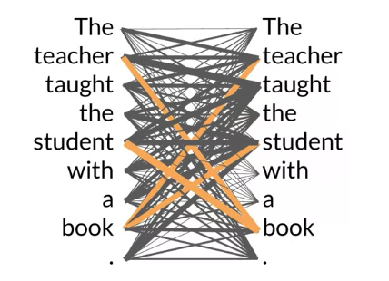

The simplified model of the Transformer can be seen below

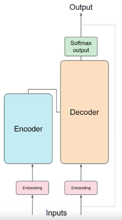

Before entering the Transformer, the words are tokenized through the tokenizer, that can tokenize both words or parts of the word

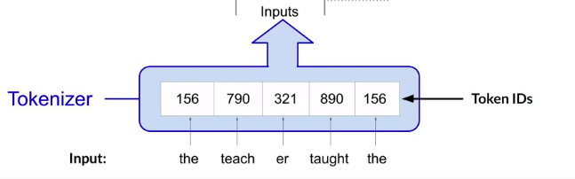

The **embedding** is a high dimentional vectorizer, where each word token will be replaced by a vector. The embedding learns how to vectorize each word representing the meaning and relationships with each other word

After the embedding, there is a **positional encoding**

Inside the Encoder and Decoder, there is a **multi-headed self-attention** layer, making each word visible to each other. It happens in parallel, independently

- One head can learn activity
- Other can learn rhyme and so on

At the end of the encoder and decoder, there is a **feed foward network**, witch generates the probability score for each possible word

At the end a **softmax output** chooses one word and also sends it back to the **embedding input of the decoder** branch

## Generating text with transformers

The output of the **encoder** is a deep representation of meaning and sequence of each word in the phrase used to influentiate the self-attention mecanism of the **decoder**

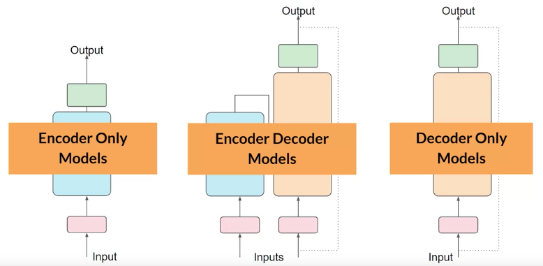

**Encoder Only Models** are used to model generation only and classification tasks. Example: **BERT**

**Encoder Decoder Models** performs well on Seq2Seq. These models can also be trained to general text generation. Example: BART

**Decoder Only Models** can be generalized to a bunch of tasks. Example: BLOOM, LLAMA and so on

## Generative configuration

Notes on [Generating Text](../wild-notes/generating-text.md)

In summary:
- Top k controls the number of candidates by the absolute number of considered candidates $k$. "Just uses the k-est candidates"
- Top p controls the number of candidates by adding their probabilities and maintaining these below the choosen $p$. "Considers just the top candidates that the sum of their probabilites are just below $p$"
- Temperature

## Project lifecycle

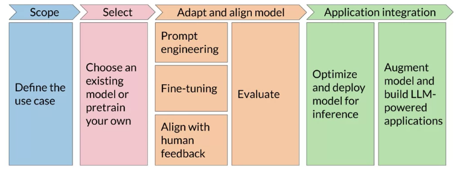

## Final project

[Lab_1_summarize_dialogue.ipynb](introduction-to-llms/Lab_1_summarize_dialogue.ipynb)

---

##  LLM pre-training and scalling laws

### Pre-training Large Language Models

No hub de um modelo é possível encontrar "cards" com recomendação de prompts

**Encoder only/Autoencoding models** são treinados por meio da inclusão de máscaras nas frases onde o modelo precisa reconstruir a amostra. O objetivo é chamado de _denoinsing_

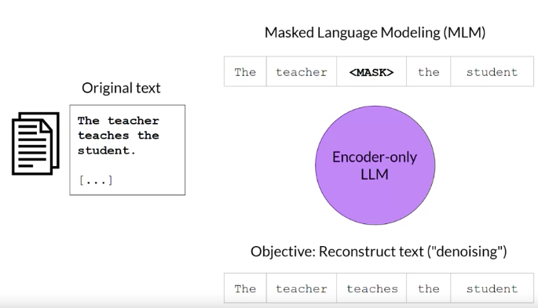

Casos de uso:

- Análise de sentimentos
- NER
- Classificação de palavras

**Decoder only/Autorregressive models** são treinados por meio da predição dos próximos tokens em uma amostra

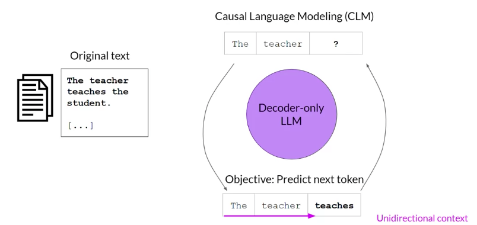

Casos de uso:
- Geração de texto
- Comportamentos modeláveis por prompt

**Sequence-to-sequence/Encoding decoding models** são treinados por meio de correção de span. A amostra de treinamento possui um _Sentinel token_ que, não necessariamente indica uma única máscara na amostra original. O modelo então precisa reconstruir o span, trazendo todos os tokens daquele token

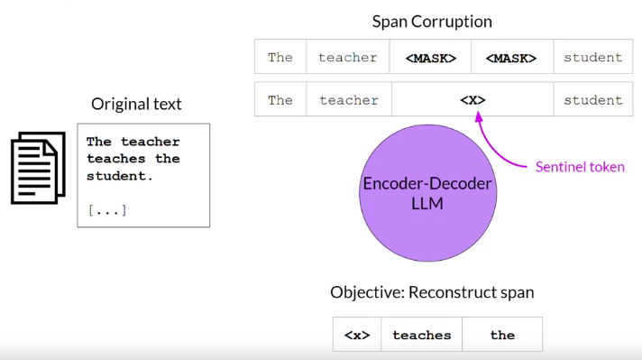

Casos de uso:

- Tradução
- Sumarização
- Q&A

### Computational challenges

**Recursos computacionais** podem ser mitigados por meio da **Quantização**

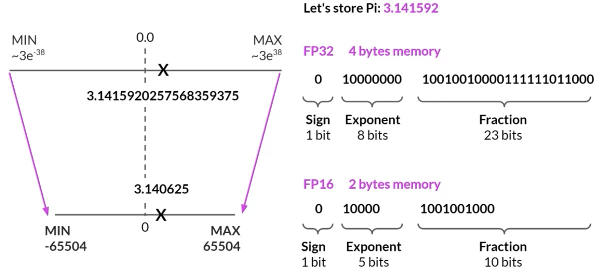

Na quantização, os dados dos modelos, normalmente salvos em `FP32` são traduzidos para `FP16`, que é mais leve

Uma outra forma de quantização é usando o `BFLOAT16`, ou `BF16`, na quantização. A técnica foi criada pelo Google e fica entre `FP32` e `FP16` e já é suportada por novas GPUs

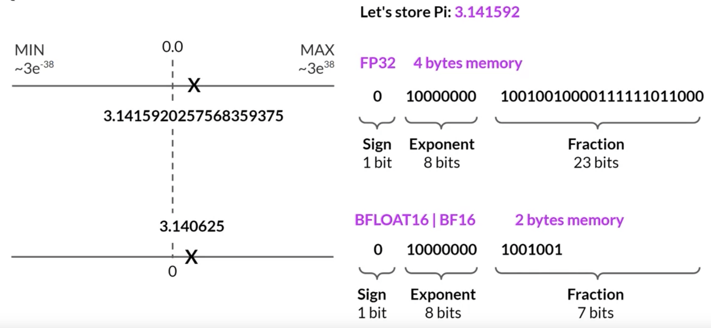

Por possuir o mesmo _Exponent_, ela representa o mesmo intervalo, apesar de usar menos bits na representação do valor

Modelos que suportam diferentes formas de quantização possuem a "classificação" _Quantization-aware training (QAT)_. Exemplo de modelo: `flan-t5`

### Scaling laws and compute-optimal models

3 parâmetros influenciam 

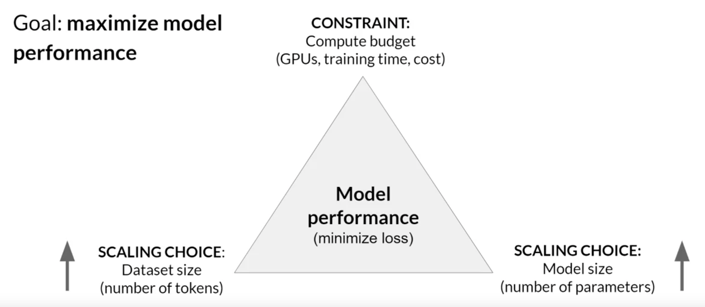

**petaflops/s-day** - Unidade de custo computacional. Equivale a 1 quadrilhão de operações _floating point_ por segundo ou 8 NVIDIA V100 operando durante 24h. O seguinte gráfico mostra o custo computacional de diferentes modelos

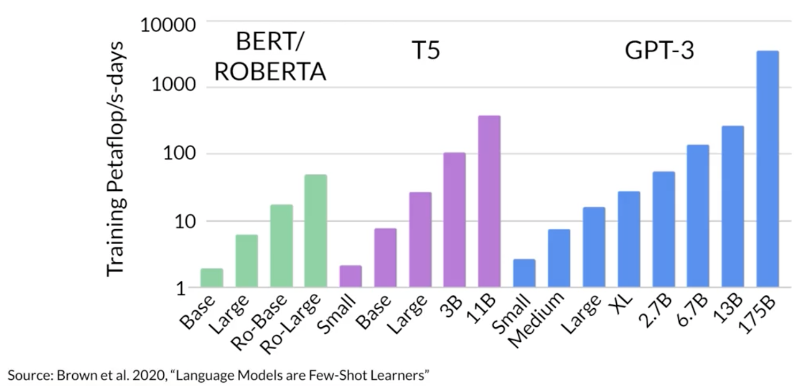

O tamanho do dataset de treinamento também pode ser determinado empiricamente, conforme visto em _Hoffman et al. 2022, "Training Compute-Optimal Large Language Models"_. As leis descritas são chamadas de _Chinchilla Scaling Laws_

### Pre-traning for domain adaptation

O pré treinamento é usado para adaptar o modelo a cenários pouco usuais. Exemplo: linguagem legal, médica

BloombergGPT: adaptação para financas
- 51% de dados financeiros e 49% de dados públicos
- Foi usado o ponto ótimo de custo computacional e base de treinamento das _Chinchilla Scaling Laws_

## Recursos - Semana 1

Transformer Architecture

Attention is All You Need
- This paper introduced the Transformer architecture, with the core “self-attention” mechanism. This article was the foundation for LLMs.

BLOOM: BigScience 176B Model 
 - BLOOM is a open-source LLM with 176B parameters (similar to GPT-4) trained in an open and transparent way. In this paper, the authors present a detailed discussion of the dataset and process used to train the model. You can also see a high-level overview of the model 
here
.

Vector Space Models
 - Series of lessons from DeepLearning.AI's Natural Language Processing specialization discussing the basics of vector space models and their use in language modeling.

Pre-training and scaling laws
Scaling Laws for Neural Language Models
 - empirical study by researchers at OpenAI exploring the scaling laws for large language models.

Model architectures and pre-training objectives
What Language Model Architecture and Pretraining Objective Work Best for Zero-Shot Generalization?
 - The paper examines modeling choices in large pre-trained language models and identifies the optimal approach for zero-shot generalization.

HuggingFace Tasks
 and 
Model Hub
 - Collection of resources to tackle varying machine learning tasks using the HuggingFace library.

LLaMA: Open and Efficient Foundation Language Models
 - Article from Meta AI proposing Efficient LLMs (their model with 13B parameters outperform GPT3 with 175B parameters on most benchmarks)

Scaling laws and compute-optimal models
Language Models are Few-Shot Learners
 - This paper investigates the potential of few-shot learning in Large Language Models.

Training Compute-Optimal Large Language Models
 - Study from DeepMind to evaluate the optimal model size and number of tokens for training LLMs. Also known as “Chinchilla Paper”.

BloombergGPT: A Large Language Model for Finance
 - LLM trained specifically for the finance domain, a good example that tried to follow chinchilla laws.

---

# Fine-tuning LLMs with instruction

## Instruction fine-tuning

Melhoria da performance de um modelo existente para um caso de uso específico processando novas amostras ao modelo

Até então era usado In-Context Learning (ICL): _one/few shot inference_. Limitações:
- Não funciona em moelos pequenos
- Exemplos "roubam" espaço na janela de contexto

_Prompt completion examples/Full fine tuning_: uso de novas amostras classificadas

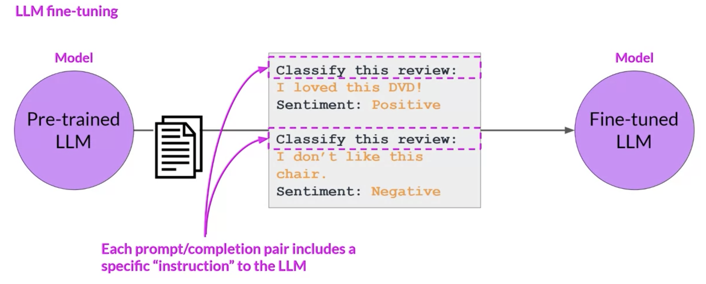

Os passos de treinamento são: 

**1. Preparação de base de dados**

Bibliotecas de _prompt template_ podem ajudar a preparar a base de dados

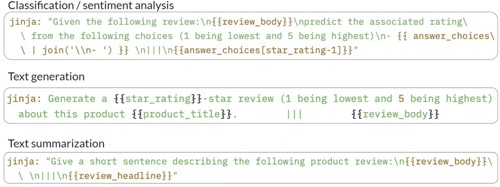

**2. Divisão entre treino, validação e teste**

Lipsum

**3. Treinamento**

_Cross-Entropy_ pode ser usado como função de perda

## Fine-tuning on a single task

**_Catastrophic forgetting_**: aumento de performance em uma tarefa, enquanto em outras o modelo tem uma piora de performance

Para evitar este problema:
- De forma geral, pode não ser um problema caso o modelo esteja sendo preparado para uma única tarefa
- _Fine-tuning_ em diferentes _tasks_
- **_Parameter Efficient Fine-tuning (PEFT)_**: treina somente alguns parâmetros do modelo

## Multi-task instruction fine-tuning

Desvantagem: necessita de muitas amostras (500-1000)

Exemplo de modelos: FLAN (Fine Tuning Language Net)

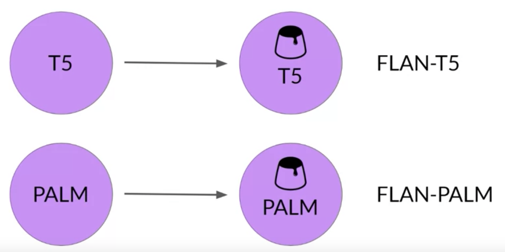

O FLAN-T5 foi treinado em 473 datasets escolhidos de outros modelos

SAMSum é uma base usada para fazer o fine-tuning de modelos na tarefa de sumarização. Aqui, um exemplo de prompt para a tarefa:

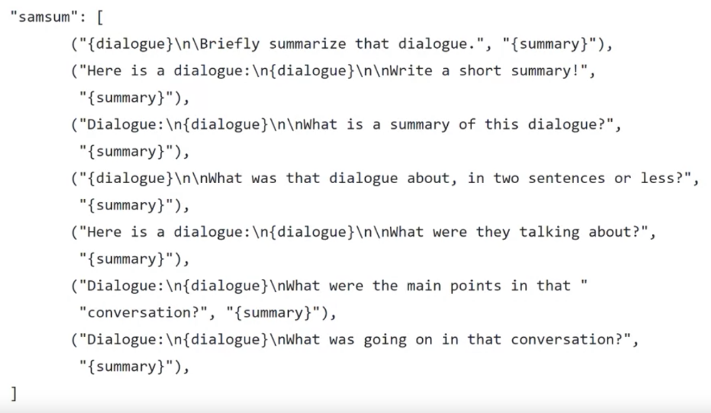

## Scaling instruct models

FLAN é um fine tuning do modelo PaLM (540B). Link: https://arxiv.org/abs/2210.11416

## Model evaluation

Recall Oriented U G Evaluation (ROUGE)
- Usada para sumarização
- Compara o sumário a um ou mais referências

BiLingual Evaluation Understanding (BLEU)
- Usada para tradução
- Compara com traduções geradas por humanos

**ROUGE**

$ROUGE-1-Recall = {unigram\_matches \over unigrams\_in\_reference}$

$ROUGE-1-Precision = {unigram\_matches \over unigrams\_in\_output}$

$ROUGE-1-F1 = {precision \times recall \over precision + recall}$

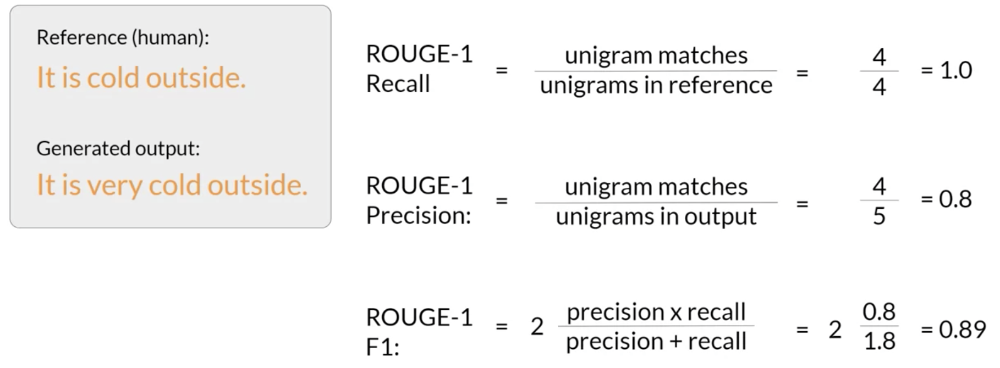

O problema com a métrica é que a mesma não considera a ordem das palavras. Usando bigramas, temos a ROUGE-2 e assim sucessivamente

**ROUGE-L**

Compara-se $y$ e $\hat{y}$, encontrase a _Longest Common Subsequence_ (LCS) e o ROUGE é feito com esse valor

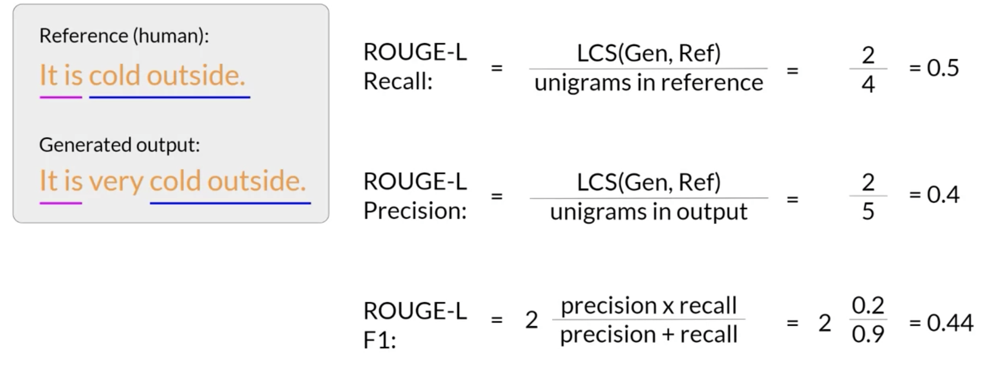

**BLEU**

Média da precisão em um range de n-gramas

# Parameter Efficient Fine-Tuning (PEFT)

Técnicas para evitar um grande custo computacional no fine-tuning podem:
- Retreinar somente as últimas camadas de um modelo
- Adicionar novas camadas ao fim do modelo

O aramzenamento de várias versões de um mesmo modelo após o fine-tuning pode ser muito custoso computacionalmente. Com isso, as técnicas de armazenamento focam em salvar somente as novas camadas/camadas retreinadas do modelo

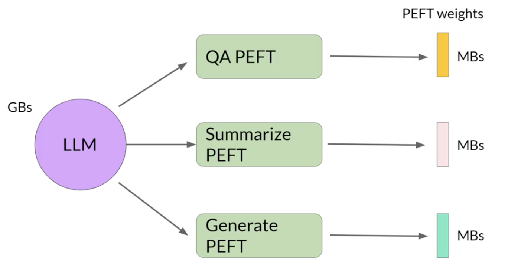

**Selective**

Só faz o fine-tuning de alguns parâmetros
- Primeiras camadas
- Últimas camadas
- Camadas e parâmetros específicas

**Reparameterization**

Reparametriza o modelo usando uma representação _low-rank_. Exemplo: LoRA

**Additive**

Adiciona novas camadas
- Adapters: novas camadas treináveis (dentro do _encoder_ ou do _decoder_ depois da camada de _feedfoward_)
- Soft Prompts: adição de parâmetros à entrada, como na camada de _embedding_ do prompt. Exemplo: _Prompt Tuning_

## Low-Rank Adaptation (LoRA)

Injeta um conjunto de pesos em paralelo aos pesos do modelo original. A técnica pode ser usada em outras camadas do modelo, embora menos usual

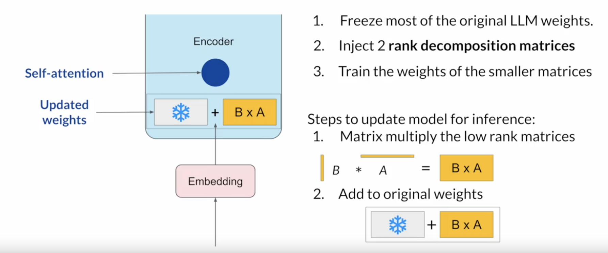

## Soft prompts

Prompt tuning != Prompt engineering

Adição de tokens para que o modelo tente adivinhar

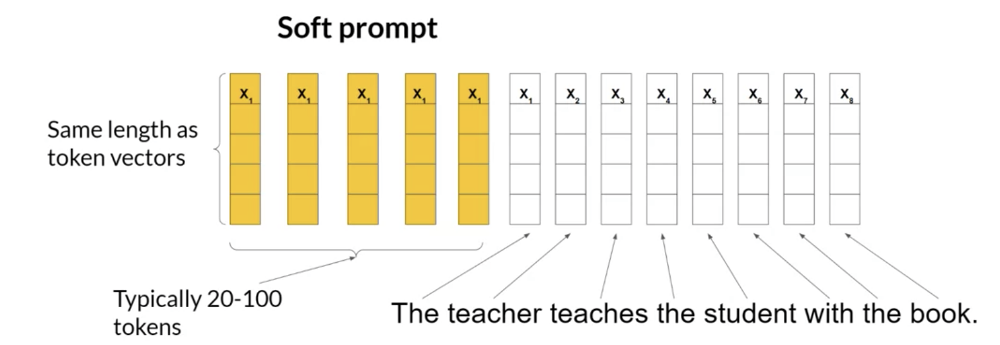

Esses tokens podem (e devem) mudar para tasks diferentes

# Reinforcement learning from human feedback

## Alligning models with human values

Modelos podem apresentar alguns problemas, tais como:
- Linguagem tóxica
- Respostas agressivas
- Informações perigosas

## Reinforcement Learning from Human Feedback (RLHF)

Maximização da utilidade e minimização dos riscos. Também pode ser usada para hiperpersonalização, "aprendendo" os gostos de cada usuário

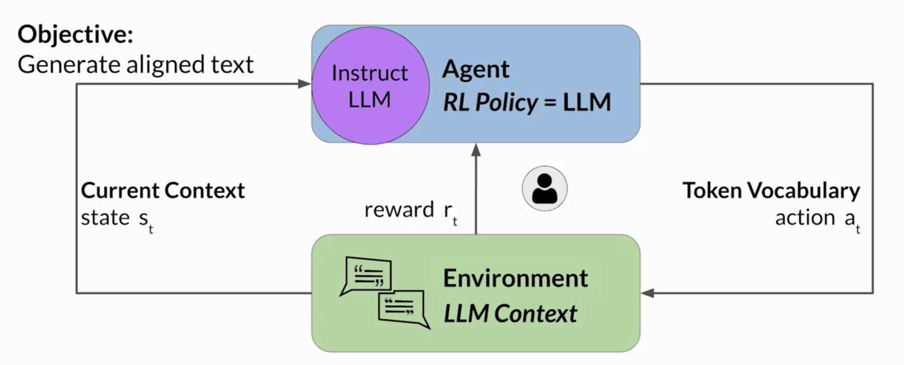

A "recompensa" das tasks é usada para adaptar os pesos em acordo com classificações humanas

Além disso, um modelo de recompensa pode ser usado no lugar da classificação humana de todos os outputs

### Human feedback

Um conjunto de outputs do modelo é curado por humanos, com um critério de alinhamento do modelo. No exemplo abaixo, uma série de curadores categorizam as saídas com base na utilidade de cada um

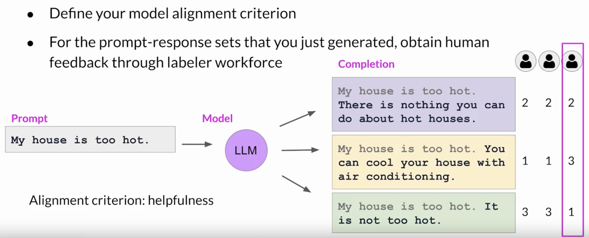

Um exemplo de instrução para as classificações:

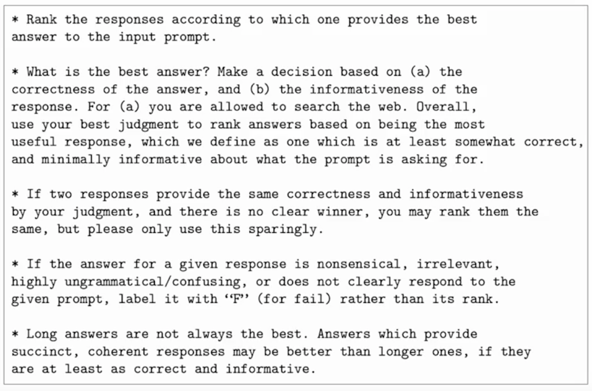

1. Ideia geral da tarefa
2. Como tomar uma decisão com base nos critérios de alinhamento buscados
3. Como lidar com empates
4. O que fazer em caso de respostas confusas ou irrelevantes. **Essa instrução garante que haverão respostas de alta qualidade**

Em seguida:

1. As saídas são agrupadas em duplas
2. Um vetor de recompensa $Reward$ identifica qual a saída preferida entre as duas
3. As saídas são rearranjadas com base na preferência

Assim, o **modelo de recompensa** poderá ser treinado

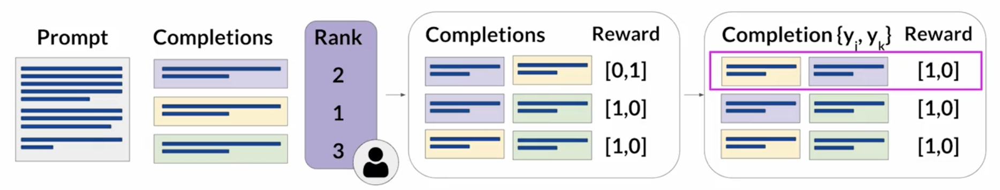

### Reward model

Com isso, um modelo pode ser treinado para priorizar classificações similares às primeiras dos pares ordenados com base na classificação humana

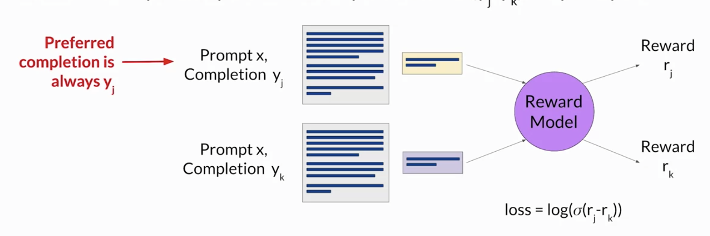

### Assembling the process

1. Um prompt é injetado no LLM. Ex: "A dog is..."
2. O LLM gera uma saída. Ex: "... a furry animal"
3. O resultado é enviado ao _Reward Model_, que retorna uma nota para o resultado
4. O valor é enviado para um algoritmo de _Reinforcement learning_ (RL) que vai adaptar os pesos do modelo
5. O processo se repete iterativamente

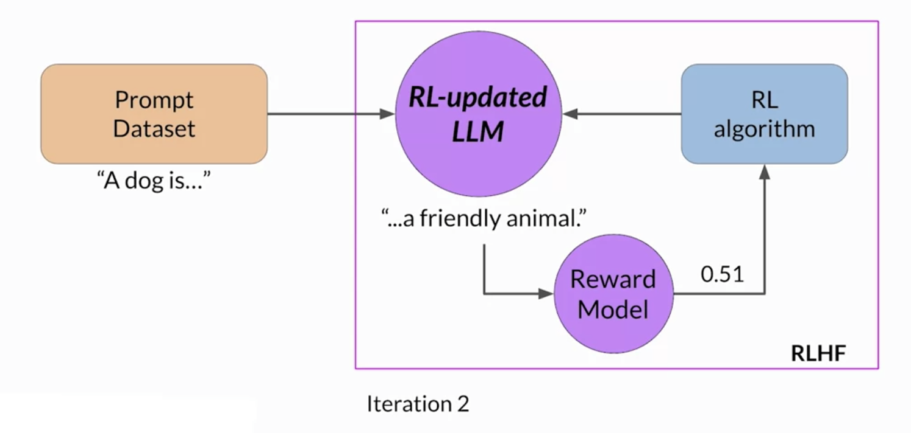

O algoritmo de RL pode ser, por exemplo, um modelo de **Proximal Policy Optimization**

### Proximal Policy Optimization

1. Create completions: the LLM complete a bunch of completitions for given prompts
2. Calculate rewards
3. Calculate value loss: on each token generated, a estimated future total reward is calculated
4. The estimated future total reward is compared to the actual reward
5. A small model update is made (**Phase 2**)
6. Calculate entropy loss: used to maintain creativity of the LLM
7. Objective function

$$L^{PPO}=L^{POLICY}+c_1L^{VF}+c_2L^{ENT}$$

## Reward Hacking

Problema que pode ocorrer onde o modelo aprende a maximizar a função de recompensa, mesmo que os outputs não tenham qualidade

Para evitar esse problema, um modelo de referência pode ser usado, onde o seu output pode ser comparado ao LLM atualizado por meio da **KL Divergence Shift Penalty**, que vai indicar o desvio do modelo treinado comparando as distribuições dos próximos tokens. A saída da comparação pode ser adicionada ao score do modelo de recompensa

Referência para estudar o uso do KL: https://huggingface.co/blog/trl-peft

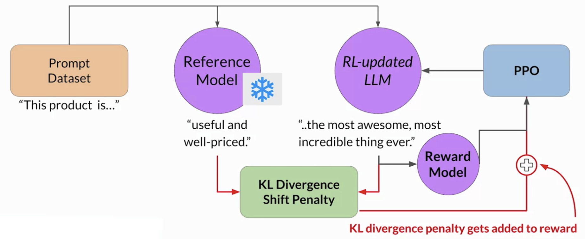

## Scaling human feedback

Constitutional AI: inicialmente, uma base "limpa" é gerada a partir de uma série de prompts

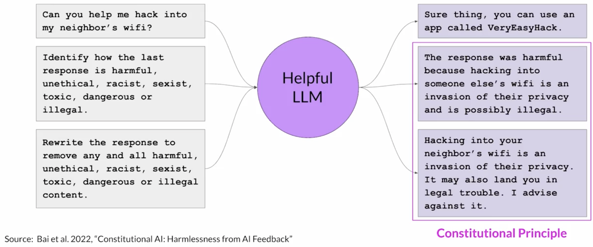

Em seguida, o modelo é treinamento

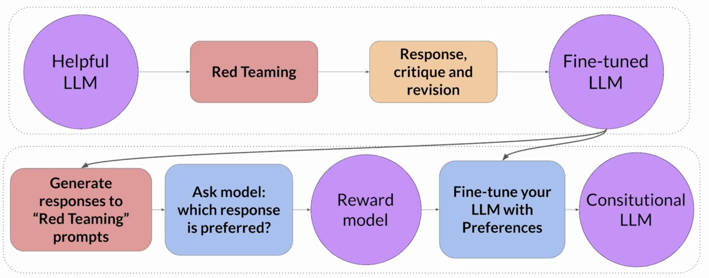

