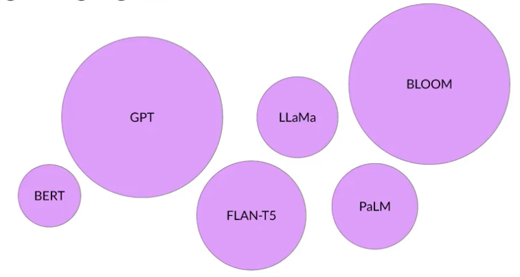

https://www.coursera.org/learn/generative-ai-with-llms

# Introduction to LLMs and the generative AI project lifecycle

## Contributors

**Ehsan Kamalinejad, Ph.D.** is a Machine Learning Applied Scientist working on NLP developments at Amazon. Previously he co-founded Visual One, a YCombinator startup in computer vision. Before that, he was a Tech-Lead Machine Learning Engineer at Apple, working on projects such as Memories. EK is also an Associate Professor of Mathematics at California State University East Bay.

**Nashlie Sephus, Ph.D.** is a Principal Technology Evangelist for Amazon AI at AWS. In this role, she focuses on fairness and accuracy as well as identifying and mitigating potential biases in artificial intelligence. She formerly led the Amazon Visual Search team as an Applied Scientist in Atlanta which launched the visual search for replacement parts on the Amazon Shopping app.

**Heiko Hotz** is a Senior Solutions Architect for AI & Machine Learning with a special focus on natural language processing (NLP), large language models (LLMs), and generative AI. Prior to this role, he was the Head of Data Science for Amazon’s EU Customer Service. Heiko helps companies be successful in their AI/ML journey on AWS and has worked with organizations in many industries, including insurance, financial services, media and entertainment, healthcare, utilities, and manufacturing. In his spare time, Heiko travels as much as possible.

**Philipp Schmid** is a Technical Lead at Hugging Face with the mission to democratize good machine learning through open source and open science. Philipp is passionate about productionizing cutting-edge and generative AI machine learning models.

## Introduction

Primeira pergunta: eu devo pegar um modelo e fazer um zero shot ou preciso treinar? Qual modelo eu posso usar?

## Use cases & model lifecycle

Principais modelos de geração de linguagem com seus tamanhos comparativos:

Entrada de um modelo: prompt

Modelo tenta prever a continuação do prompt. Caso a entrada seja uma pergunta, a saída será uma resposta

Casos de uso

- Q&A
- Sumarização
- Tradução
- Geração de código
- Extração de entidades
- _Augmented LLMs_: conexão com outras bases e APIs para prover dados não fornecidos no pré treino. Exemplo: perguntar a um modelo se um voo está atrasado ou não

### Text generation before transformers

Modelos usando RNNs escalam exponencialmente em escala para compreender mais tokens de uma amostra ao mesmo tempo (uma janela maior de entrada)

O idioma é complexo e ambíguo, compalavras homônimas e afins

**Attention Is All You Need** foi o primeiro artigo explicando o mecanismo de atenção dos **Transformers**

### Transformers Architecture