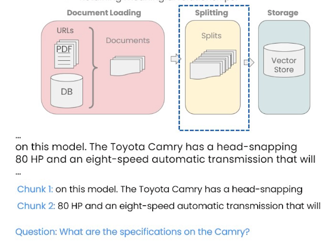
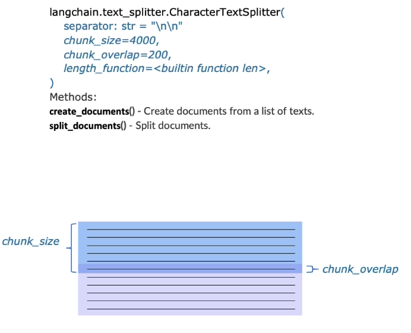
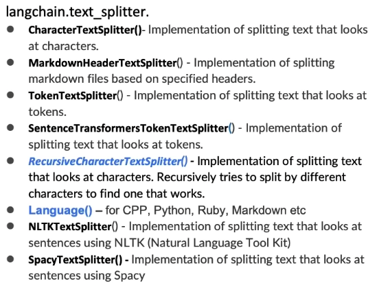
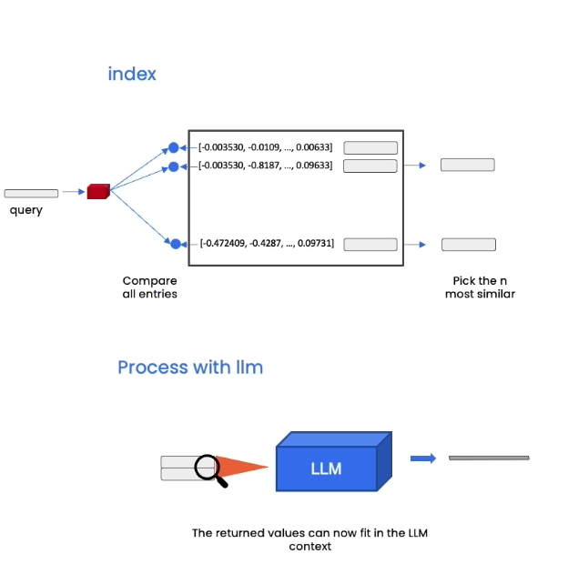
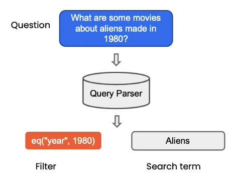
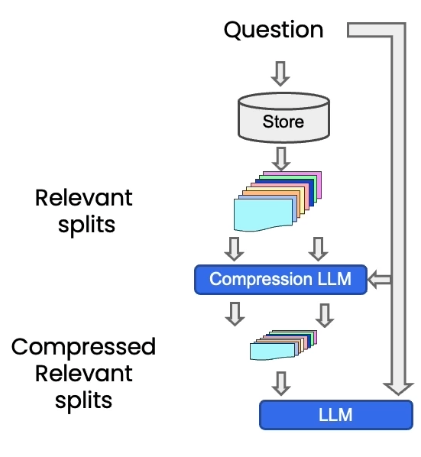
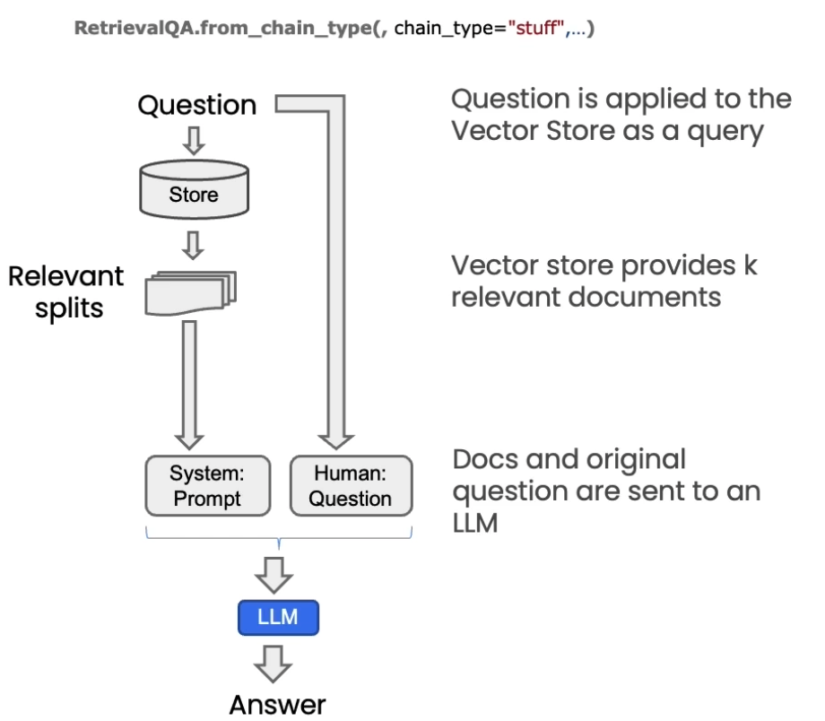
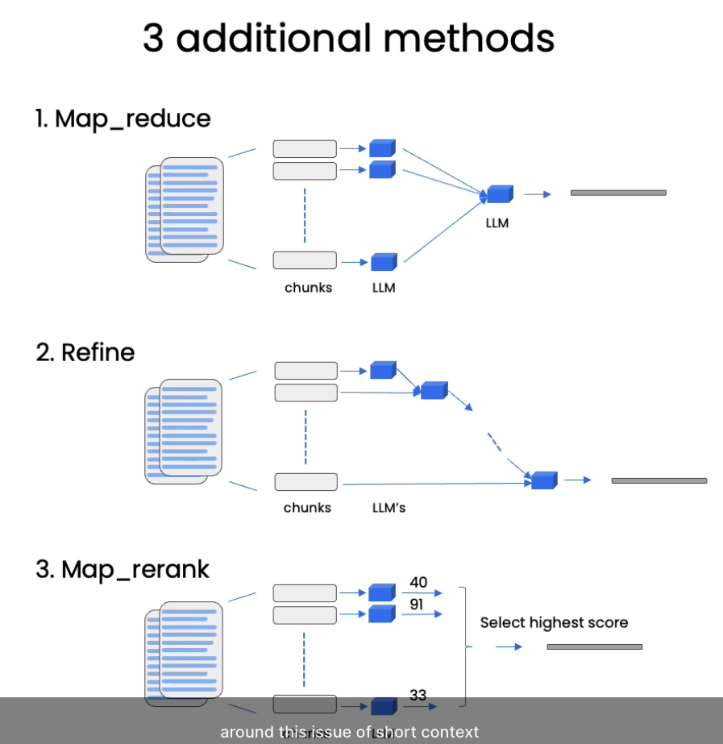
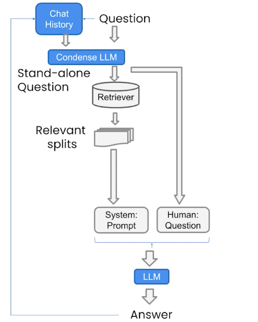

https://learn.deeplearning.ai/langchain-chat-with-your-data

> LangChain and LLMs are a way to chat with your data

# Document loading

80 different types of document loaders to access

- Websites
- DBs
- Youtube
- arXiv...
- PDF
- HTML
- Json
- Word, PPT...

[Notebook 1](notebooks/01_document_loading.ipynb)

# Document splitting

Happens after loading the data

To avoid the loss of information from one chunk to the other, a **chunk overlap** can be used

Chunking can happen in different ways

[Notebook 2](notebooks/02_document_splitting.ipynb)

# Vectorstores and embeddings

[Notebook 03_vectorstores_and_embeddings](notebooks/03_vectorstores_and_embeddings.ipynb)

# Retrieval

## Maximum Marginal Relevance (MMR)

You may not always want to choose the most similar responses

- Diversity of information

How

- Query the vector store
- `fetch_k` most similar responses
- Within those responses choose the `k` most diverse

## LLM Aided retrieval

## Compression

[Notebook 04_retrieval](notebooks/04_retrieval.ipynb)

# Question Answering

To deal with the problem of short context window, there are 3 methods:

- Map_reduce: each chunk is sent to the model and the answers are sent together to a final response. Slower
- Refine
- Map_rerank

[Notebook 05_question_answering.ipynb](notebooks/05_question_answering.ipynb)

# Chat

Similar as previous content, but with a `Chat history`

[Notebook 06_chat.ipynb](notebooks/06_chat.ipynb)