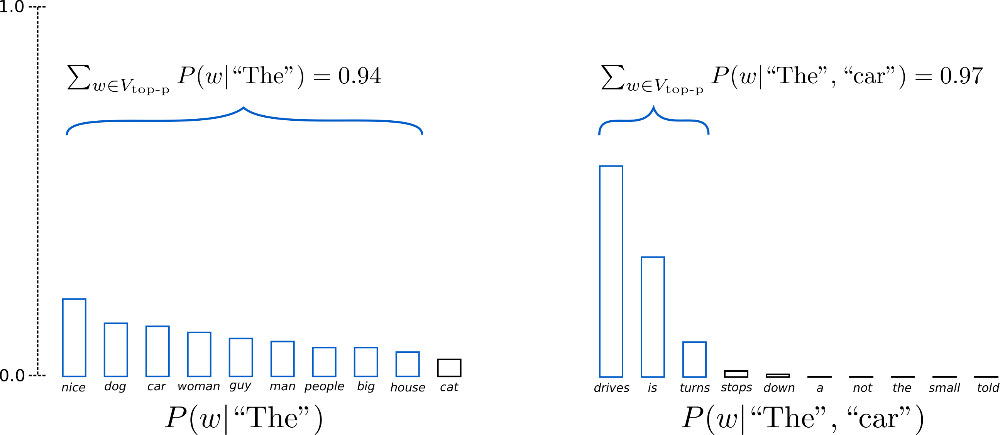

https://huggingface.co/blog/how-to-generate

> auto-regressive language generation is based on the assumption that the probability distribution of a word sequence can be decomposed into the product of conditional next word distributions

$$
P(w_{1:T} | W_0) = \prod_{t=1}^{T} P(w_t | w_{1:t-1}, W_0), \forall w_{1:0}=∅
$$

Nessa equação:
- $W_0$ é a sequência inicial de palavras do contexto
- O comprimento da sequência de palavras $T$ é determinado _on-the-fly_


# Greedy Search

Método de decodificação mais simples, **selectionando a palavra com a maior probabilidade** em cada timestep $t$ por meio de $w_t=argmax_wP(w| w_{1:t-1})$


Principais problemas:
- Greedy search tem uma tendência maior a ter problemas com repetição de palavras
- Palavras com alta probabilidade "atrás" de palavras com uma baixa probabilidade tendem a não serem alcançadas. Exemplo: _has_ ($P=0.9$) não foi empregada por estar "atrás" de _dog_($P=0.4$)

Em código:

```python
from transformers import AutoModelForCausalLM, AutoTokenizer
import torch

torch_device = "cuda" if torch.cuda.is_available() else "cpu"

tokenizer = AutoTokenizer.from_pretrained("gpt2")

# add the EOS token as PAD token to avoid warnings
model = AutoModelForCausalLM.from_pretrained("gpt2", pad_token_id=tokenizer.eos_token_id).to(torch_device)
```

```python
# encode context the generation is conditioned on
model_inputs = tokenizer('I enjoy walking with my cute dog', return_tensors='pt').to(torch_device)

# generate 40 new tokens
greedy_output = model.generate(**model_inputs, max_new_tokens=40)

print("Output:\n" + 100 * '-')
print(tokenizer.decode(greedy_output[0], skip_special_tokens=True))
```

# Beam search

No Beam search é feita uma "probabilidade múltipla", analisando a probabilidade de um conjunto de palavras. Para um `num_beams=1`, por exemplo, a análise será da seguinte forma:


- $P("The", "dog", "has")=0.36$
- $P("The", "nice", "woman")=0.2$

Com isso, **o problema de repetição é minimizado**

Em código:

```python
# activate beam search and early_stopping
beam_output = model.generate(
    **model_inputs,
    max_new_tokens=40,
    num_beams=5,
    early_stopping=True
)

print("Output:\n" + 100 * '-')
print(tokenizer.decode(beam_output[0], skip_special_tokens=True))
```

# Sampling


Seleção randômica da próxima palavra $w_t$ de acordo com a distribuição de probabilidade condicional:

$$
w_t ∼ P(w|w_{1:t-1})
$$

No entanto, **esta abordagem não é mais determinística**


Em código:

```python
# set seed to reproduce results. Feel free to change the seed though to get different results
from transformers import set_seed
set_seed(42)

# activate sampling and deactivate top_k by setting top_k sampling to 0
sample_output = model.generate(
    **model_inputs,
    max_new_tokens=40,
    do_sample=True,
    top_k=0
)

print("Output:\n" + 100 * '-')
print(tokenizer.decode(sample_output[0], skip_special_tokens=True))
```

O problema com esta abordagem é que ela acaba gerando textos pouco naturais. Uma forma de resolver é aumentando a probabilidade de escolher palavras muito ou pouco prováveis por meio da **temperatura** do modelo. Em código:

```python
# set seed to reproduce results. Feel free to change the seed though to get different results
set_seed(42)

# use temperature to decrease the sensitivity to low probability candidates
sample_output = model.generate(
    **model_inputs,
    max_new_tokens=40,
    do_sample=True,
    top_k=0,
    temperature=0.6,
)

print("Output:\n" + 100 * '-')
print(tokenizer.decode(sample_output[0], skip_special_tokens=True))
```

# Tok-K sampling


Em código:

```python
# set seed to reproduce results. Feel free to change the seed though to get different results
set_seed(42)

# set top_k to 50
sample_output = model.generate(
    **model_inputs,
    max_new_tokens=40,
    do_sample=True,
    top_k=50
)

print("Output:\n" + 100 * '-')
print(tokenizer.decode(sample_output[0], skip_special_tokens=True))
```

# Top-p (nucleous) sampling

Nesta técnica, escolhe-se o menor arranjo possível de palavras que a probabilidade cumulativa ultrapassa o limiar $p$. Desta forma **é possível controlar o tamanho da geração com base na probabilidade** $p$.



Em código:

```python
# set seed to reproduce results. Feel free to change the seed though to get different results
set_seed(42)

# set top_k to 50
sample_output = model.generate(
    **model_inputs,
    max_new_tokens=40,
    do_sample=True,
    top_p=0.92,
    top_k=0
)

print("Output:\n" + 100 * '-')
print(tokenizer.decode(sample_output[0], skip_special_tokens=True))
```

Top-p e top-k podem ser usadas em conjunto para evitar palavras pouco ranqueadas. Em código:

```python
# set seed to reproduce results. Feel free to change the seed though to get different results
set_seed(42)

# set top_k = 50 and set top_p = 0.95 and num_return_sequences = 3
sample_outputs = model.generate(
    **model_inputs,
    max_new_tokens=40,
    do_sample=True,
    top_k=50,
    top_p=0.95,
    num_return_sequences=3,
)

print("Output:\n" + 100 * '-')
for i, sample_output in enumerate(sample_outputs):
  print("{}: {}".format(i, tokenizer.decode(sample_output, skip_special_tokens=True)))
```